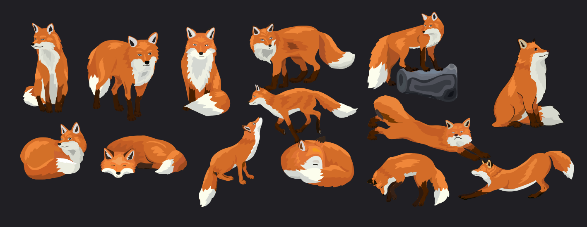
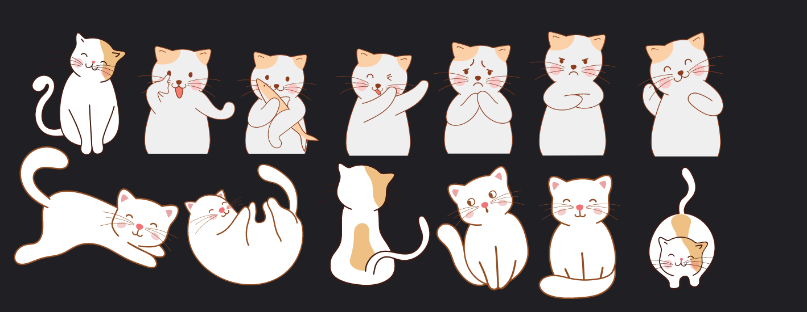
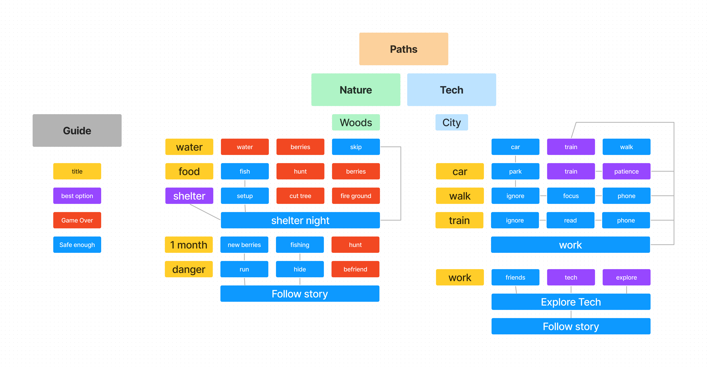
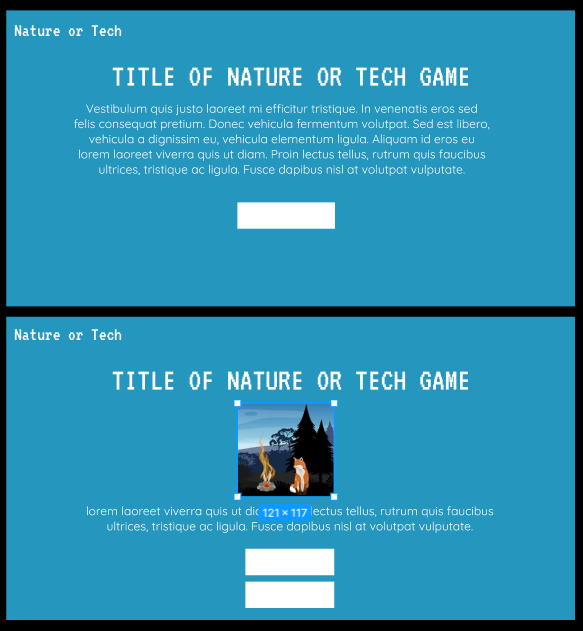
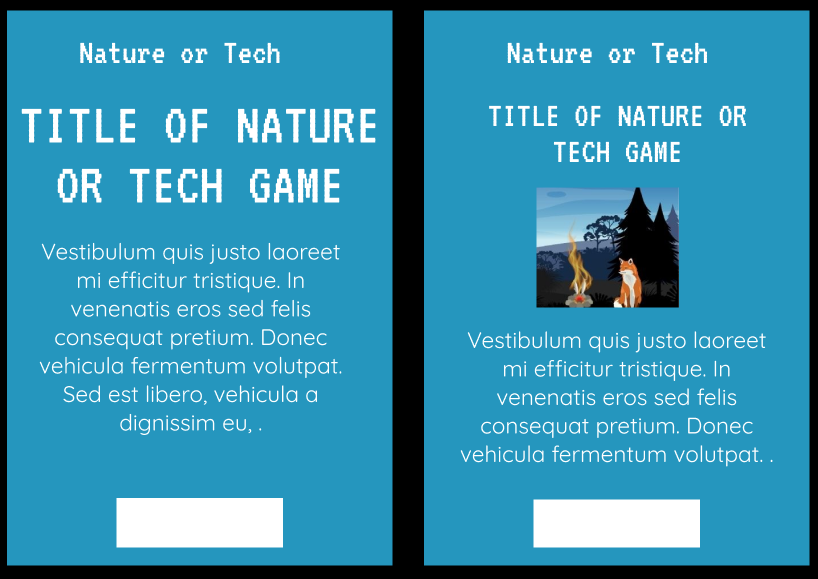
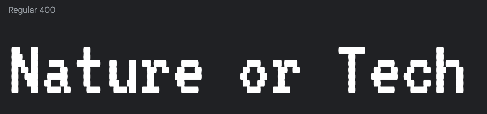
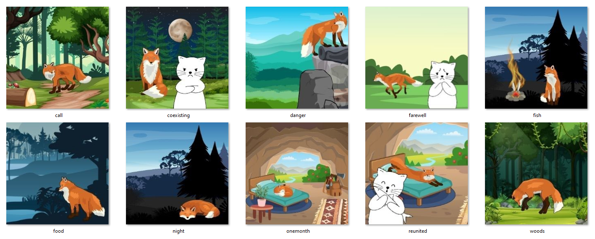
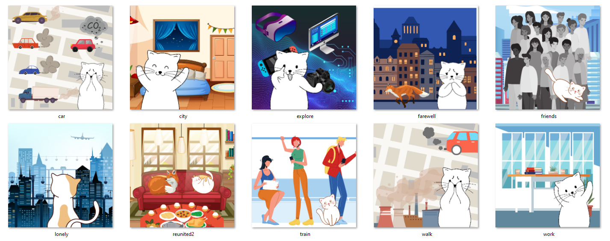

# Nature or Tech

[View live project here on GitHub](https://solracnauj92.github.io/Hero-s-Tale/)

Nature or Tech" is an interactive choose-your-own-journey narrative game that centers around the idea of having to choose between nature and technology in our daily lives. The game features two distinct story paths that players can choose from, each with its own character and unique storyline.
   

  

---

## CONTENTS  
  
  * [User Experience](#user-experience-ux)
    * [Goal](#goal) 
    * [Targets](#targets)
    * [First Time Visitor](#first-time-visitor) 
    * [Returning Visitor](#returning-visitor) 
    * [Frequent Visitor](#frequent-visitor) 
  * [Story Development](#creation-process)
    * [Characters](#characters) 
    * [Location & Objects](#locations) 
    * [Worldbuilding](#worldbuilding) 
  * [Wireframes](#wireframes)
    * [Desktop](#desktop) 
    * [Tablet](#tablet) 
    * [Mobile](#Mobile) 
  * [Design & Media](#design-media)
    * [Brand](#brand) 
    * [Colour Palette](#colour-palette) 
    * [Typography](#typography)  
    * [Artwork](#artwork) 
    * [Audio](#audio) 
    * [Background Video](#background-video)
  * [Desktop, Tablet & Mobile Testings](#desktop-desktop--mobile-testing)
    * [Desktop](#desktop-preview) 
    * [Tablet](#tablet-preview)
    * [Mobile](#Mobile-preview) 
  * [Future Features](#future-features)
  * [Technologies Used](#technologies-used)
  * [Deployment](#deployment)
  * [How to deploy](#how-to-deploy)
  * [Audits](#validation)
    * [HTML Validation](#desktop-preview) 
    * [CSS Validation](#tablet-preview)
    * [JS Validation](#mobile-preview) 
    * [Performance Report](#lighthouse)
  * [Bugs & Fixes](#bugs--fixes)
  * [Credits](#credits) 
    * [Content References](#references) 
    * [Copyright](#copytright)
    * [Acknowledgements](#acknowledgements)

    --- 

## User Experience (UX)  

### **Goal**  
  
1. Entertaining Experience: Visitors may be looking for an engaging and interactive experience. The choose-your-own-journey narrative game can offer a fun and enjoyable experience that keeps them engaged throughout their journey.

 

2. Learning About Nature and Technology: Visitors who are interested in learning about the benefits and drawbacks of nature and technology can benefit from the educational information presented in the game. The interactive format can make the learning experience more engaging and memorable.

 

3. Exploring Different Story Paths: Visitors who enjoy interactive narrative games may be interested in exploring the different story paths available in the game. The unique storylines and characters can offer a different experience each time they play.

 

4. Sharing with Others: Visitors may want to share their experience with friends and family. The game's engaging and interactive format can make it easy to share and discuss the lessons learned about nature and technology.

 

### **Targets**

5. Age Group: The game is appropriate for a wide range of ages, from pre teen to young adults and beyond. The game can also attract parents who would like to educate their young children under supervision. After all the content is educational, and the interactive narrative format may appeal to those who enjoy storytelling and interactive games. 

 

6. Geographic Location: The game is relevant to people across the world, regardless of their geographic location. The game is accessible to anyone with an internet connection and an interest in the topic.

 

7. User Engagement: The game is designed to keep users engaged and interested throughout their journey. The use of artwork, compelling storytelling, a visually appealing design help keep users engaged.

 

8. User Empowerment: The game should empower users to make informed decisions about their use of technology and their relationship with nature. The game should provide users with the tools and knowledge needed to strike a balance between the two.

 
 
### **First Time Visitor**

- Learning and playing the Game: The first-time visitor may want to play and learn more about the game, including its premise, gameplay mechanics, and overall purpose. The goal is to finish the game and learn along the way. Regardless of which path they take or decisions. The visitor is free to repeat the game as much as they like,  It provides a new experience each time they are played.

 

- Discovering Educational Content: The first-time visitor may be interested in discovering educational content related to the game's theme. 

 

- Sharing the Game with Others: The first-time visitor may enjoy the game and want to share it with friends and family who may also be interested in the topic.

 

### **Returning Visitor**

- Exploring Different Story Paths: Returning visitors may be interested in exploring the second story path. They may want to experience different endings or make different choices to see how the story changes.

 

### **Frequent Visitor**  

- Story update and sharing: they would frequently check to see whether the narrative had been updated, or one could simply wish to re-experience the game again on their own or with their friends or families. 

  

- Engaging with the Community: Frequent visitors may want to engage with other players and community members who share their interest in the game's theme. They may want to participate in online discussions or join social media groups related to the game.

 

--- 

## Story Development 
  
### **1. Characters**  
The first thing I have done is finding my character. This is important as a story developer to visualise them in situations whilst I build up the story. Canva provided me with character designs featuring various poses and actions. I carefully selected designs that matched in appearance for the fox. Unfortunately, there were fewer options available for the cat in comparison, so I utilized similar cat designs and primarily used black and white colors to maintain a cohesive aesthetic between the two characters.

 

One of my favorite characters of all time is Paddington, created by Michael Bond. Initially from the jungle, Paddington later finds himself exploring the city. In my case, I have switched things around because the colors of the fox reminded me of Paddington, and since a fox is more likely to prefer living in nature, I thought it would be fitting to have a cat as the city-dwelling character.

The reason I gave the cat the name Marshmallow was because to me, it resembled a marshmallow.

### **2. Locations & Objects**  

After that, I selected the necessary location and objects for the scene. As a story developer, this step is crucial for me to envision the story as I construct it.

 

### **3. World Building**  

Through mind mapping, I was able to create a world-building framework for both paths in my game. Each scene seamlessly transitions into the next, creating a guide to the overall direction of the game. By visualising this framework on Figma, I was able to analyze the story from a more organised perspective and refine the paths to further develop the narrative.

--- 

## Wireframes

Using Figma, I crafted the wireframes both desktop and mobile. Initially, I was unaware that the background would be in video format. however, the design helped me in envisioning the page's appearance, enabling me to experiment with various text fonts, sizes, and weights. This allowed me to style in CSS with ease after visualizing its look and feel.

### **Desktop**  

### **Mobile**

--- 

## Design & Media

### **Brand**  

I have chosen to go ahead with a text logo for the following reasons: 

1. Flexibility: Text logos are generally more flexible than image-based logos since they can be easily scaled up or down and used in a variety of contexts.

2. Simplicity: Text logos are often simpler and more straightforward than image-based logos, which can make them more memorable and easier to recognize. They can also be more versatile, allowing for variations in font, color, and style.

3. Clarity: Text logos can be more clear and legible than image-based logos, particularly when the logo needs to be displayed at a small size or in a low-resolution format. This can ensure that the logo is always visible and recognizable, even in challenging circumstances.

### **Colour Palette**

Despite using a video for the background, I primarily centered the color palette around blue since it is associated with both nature and technology. White was chosen for the text to ensure readability, as black would have been difficult to see against the video. The colours shown below are an approximate blend of the hues present in the video.
 
[Palette Link](https://coolors.co/000000-13102d-1e5c7e-2596be-3ec2d1-c0c4c2-ffffff) 
 

 

### **Typography**

I used Google Fonts for my website, taking advantage of its vast library of 1,493 open source font families. Here are the chosen fonts for this project: 

1. [VT323, by Peter Hull](https://fonts.google.com/specimen/VT323) was used due its legibility, retro style, and ease of use.

2. [Quicksand, Designed by Andrew Paglinawan](https://fonts.google.com/specimen/Quicksand) was used due it's modern and friendly appearance, making it suitable for a wide range of audience. It is also highly legible, making it easy for players to read instructions and text within the game.

### **Artwork & Video**
As a Canva Pro user, I was able to access a wide variety of additional features and resources, including a vast library of licensed images, videos graphics, and templates that could be used without infringing on copyright laws. Drawing on my photography and design skills, I used these resources to create unique and visually striking artwork for this project. Whereas the video I used was included within Canva's library. 

  

### **Audio**

 
For this game, I used Pixabay to discover an audio that is free of copyright. I believed that incorporating this would serve as an excellent interactive feature to elevate the overall experience of the player. 
 
[Lexin Music by Aleksey Chistilin](https://pixabay.com/music/beautiful-plays-spirit-landscape-118015/) 

--- 
